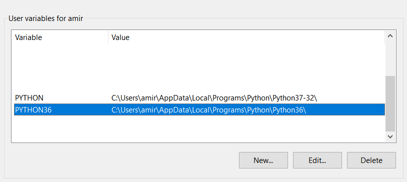
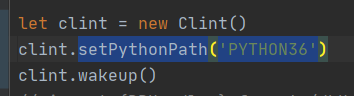

# How to Install

Currently only Python 3.6.x is supported.

<details>
<summary>Setting up environment variables</summary>

```
In the parent directory, there is a 'python-controller.js' script which contains the 'Clint' class.
The Class 'Clint' has a method called 'setPythonPath(path)'.
Not using it, the class will use your system's default Python path which may not be of version 3.6.x .
after installing Python 3.6.x and adding it to your system's "environment variables",
use 'setPythonPath(path) to point the app to the right python version'
```


</details>

<br/>

**Dependencies :**
> [SpeechRecognition](https://pypi.org/project/SpeechRecognition/)
>
> [pyttsx3](https://pypi.org/project/pyttsx3/)
>
> [pyaudio](https://pypi.org/project/PyAudio/)
>
> [requests](https://pypi.org/project/requests/)

to **Install** python packages:

    $ pip install -r requirements.txt

## Development
The 'main.py' script is the app's entry point.

You can run by using :

    $ python main.py

